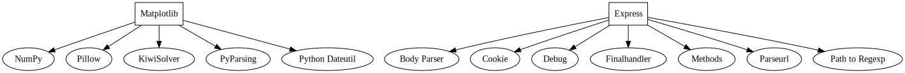
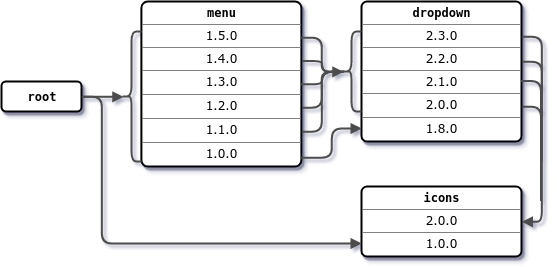

# Практическое занятие №2. Менеджеры пакетов

## **Задача №1**
Вывести служебную информацию о пакете `matplotlib` (Python). Разобрать основные элементы содержимого файла со служебной информацией из пакета. Как получить пакет без менеджера пакетов, прямо из репозитория?
```python
pip install matplotlib
```
```
Requirement already satisfied: matplotlib in /usr/local/lib/python3.10/dist-packages (3.7.1)
Requirement already satisfied: contourpy>=1.0.1 in /usr/local/lib/python3.10/dist-packages (from matplotlib) (1.3.0)
Requirement already satisfied: cycler>=0.10 in /usr/local/lib/python3.10/dist-packages (from matplotlib) (0.12.1)
Requirement already satisfied: fonttools>=4.22.0 in /usr/local/lib/python3.10/dist-packages (from matplotlib) (4.54.1)
Requirement already satisfied: kiwisolver>=1.0.1 in /usr/local/lib/python3.10/dist-packages (from matplotlib) (1.4.7)
Requirement already satisfied: numpy>=1.20 in /usr/local/lib/python3.10/dist-packages (from matplotlib) (1.26.4)
Requirement already satisfied: packaging>=20.0 in /usr/local/lib/python3.10/dist-packages (from matplotlib) (24.1)
Requirement already satisfied: pillow>=6.2.0 in /usr/local/lib/python3.10/dist-packages (from matplotlib) (10.4.0)
Requirement already satisfied: pyparsing>=2.3.1 in /usr/local/lib/python3.10/dist-packages (from matplotlib) (3.1.4)
Requirement already satisfied: python-dateutil>=2.7 in /usr/local/lib/python3.10/dist-packages (from matplotlib) (2.8.2)
Requirement already satisfied: six>=1.5 in /usr/local/lib/python3.10/dist-packages (from python-dateutil>=2.7->matplotlib) (1.16.0)
```

```python
pip show matplotlib
```
```
Name: matplotlib
Version: 3.7.1
Summary: Python plotting package
Home-page: https://matplotlib.org
Author: John D. Hunter, Michael Droettboom
Author-email: matplotlib-users@python.org
License: PSF
Location: /usr/local/lib/python3.10/dist-packages
Requires: contourpy, cycler, fonttools, kiwisolver, numpy, packaging, pillow, pyparsing, python-dateutil
Required-by: arviz, bigframes, datascience, fastai, geemap, imgaug, matplotlib-venn, missingno, mlxtend, music21, plotnine, prophet, pycocotools, seaborn, wordcloud, yellowbrick
```

```python
pip freeze
```
```
absl-py==1.4.0
accelerate==0.34.2
aiohappyeyeballs==2.4.3
aiohttp==3.10.8
aiosignal==1.3.1
alabaster==0.7.16
albucore==0.0.16
albumentations==1.4.15
altair==4.2.2
annotated-types==0.7.0
anyio==3.7.1
argon2-cffi==23.1.0
argon2-cffi-bindings==21.2.0
array_record==0.5.1
arviz==0.19.0
astropy==6.1.4
astropy-iers-data==0.2024.9.30.0.32.59
astunparse==1.6.3
async-timeout==4.0.3
atpublic==4.1.0
attrs==24.2.0
audioread==3.0.1
autograd==1.7.0
babel==2.16.0
...
```

```python
pip install pipdeptree
```
```
Collecting pipdeptree
  Downloading pipdeptree-2.23.4-py3-none-any.whl.metadata (15 kB)
Requirement already satisfied: packaging>=24.1 in /usr/local/lib/python3.10/dist-packages (from pipdeptree) (24.1)
Collecting pip>=24.2 (from pipdeptree)
  Using cached pip-24.2-py3-none-any.whl.metadata (3.6 kB)
Downloading pipdeptree-2.23.4-py3-none-any.whl (32 kB)
Using cached pip-24.2-py3-none-any.whl (1.8 MB)
Installing collected packages: pip, pipdeptree
  Attempting uninstall: pip
    Found existing installation: pip 24.1.2
    Uninstalling pip-24.1.2:
      Successfully uninstalled pip-24.1.2
Successfully installed pip-24.2 pipdeptree-2.23.4
```

```python
!pipdeptree
```
```
│           │   ├── mistune [required: >=0.8.1,<2, installed: 0.8.4]
│           │   ├── nbclient [required: >=0.5.0, installed: 0.10.0]
│           │   │   ├── jupyter-client [required: >=6.1.12, installed: 6.1.12]
│           │   │   │   ├── jupyter_core [required: >=4.6.0, installed: 5.7.2]
│           │   │   │   │   ├── platformdirs [required: >=2.5, installed: 4.3.6]
│           │   │   │   │   └── traitlets [required: >=5.3, installed: 5.7.1]
│           │   │   │   ├── python-dateutil [required: >=2.1, installed: 2.8.2]
│           │   │   │   │   └── six [required: >=1.5, installed: 1.16.0]
│           │   │   │   ├── pyzmq [required: >=13, installed: 24.0.1]
│           │   │   │   ├── tornado [required: >=4.1, installed: 6.3.3]
│           │   │   │   └── traitlets [required: Any, installed: 5.7.1]
│           │   │   ├── jupyter_core [required: >=4.12,!=5.0.*, installed: 5.7.2]
│           │   │   │   ├── platformdirs [required: >=2.5, installed: 4.3.6]
│           │   │   │   └── traitlets [required: >=5.3, installed: 5.7.1]
│           │   │   ├── nbformat [required: >=5.1, installed: 5.10.4]
│           │   │   │   ├── fastjsonschema [required: >=2.15, installed: 2.20.0]
│           │   │   │   ├── jsonschema [required: >=2.6, installed: 4.23.0]
│           │   │   │   │   ├── attrs [required: >=22.2.0, installed: 24.2.0]
│           │   │   │   │   ├── jsonschema-specifications [required: >=2023.03.6, installed: 2023.12.1]
│           │   │   │   │   │   └── referencing [required: >=0.31.0, installed: 0.35.1]
│           │   │   │   │   │       ├── attrs [required: >=22.2.0, installed: 24.2.0]
│           │   │   │   │   │       └── rpds-py [required: >=0.7.0, installed: 0.20.0]
│           │   │   │   │   ├── referencing [required: >=0.28.4, installed: 0.35.1]
│           │   │   │   │   │   ├── attrs [required: >=22.2.0, installed: 24.2.0]
│           │   │   │   │   │   └── rpds-py [required: >=0.7.0, installed: 0.20.0]
│           │   │   │   │   └── rpds-py [required: >=0.7.1, installed: 0.20.0]
│           │   │   │   ├── jupyter_core [required: >=4.12,!=5.0.*, installed: 5.7.2]
│           │   │   │   │   ├── platformdirs [required: >=2.5, installed: 4.3.6]
│           │   │   │   │   └── traitlets [required: >=5.3, installed: 5.7.1]
│           │   │   │   └── traitlets [required: >=5.1, installed: 5.7.1]
│           │   │   └── traitlets [required: >=5.4, installed: 5.7.1]
```

```python
!pipdeptree --packages matplotlib
```
```
Warning!!! Duplicate package metadata found:
"/usr/lib/python3/dist-packages"
  six                              1.16.0           (using 1.16.0, "/usr/local/lib/python3.10/dist-packages")
  python-apt                       2.4.0+ubuntu4    (using 2.4.0, "/usr/local/lib/python3.10/dist-packages")
NOTE: This warning isn't a failure warning.
------------------------------------------------------------------------
Warning!!! Possibly conflicting dependencies found:
* ipython==7.34.0
 - jedi [required: >=0.16, installed: ?]
* PyGObject==3.42.1
 - pycairo [required: >=1.16.0, installed: ?]
------------------------------------------------------------------------
matplotlib==3.7.1
├── contourpy [required: >=1.0.1, installed: 1.3.0]
│   └── numpy [required: >=1.23, installed: 1.26.4]
├── cycler [required: >=0.10, installed: 0.12.1]
├── fonttools [required: >=4.22.0, installed: 4.54.1]
├── kiwisolver [required: >=1.0.1, installed: 1.4.7]
├── numpy [required: >=1.20, installed: 1.26.4]
├── packaging [required: >=20.0, installed: 24.1]
├── pillow [required: >=6.2.0, installed: 10.4.0]
├── pyparsing [required: >=2.3.1, installed: 3.1.4]
└── python-dateutil [required: >=2.7, installed: 2.8.2]
    └── six [required: >=1.5, installed: 1.16.0]
```

## **Задача №2**
Вывести служебную информацию о пакете `express` (JavaScript). Разобрать основные элементы содержимого файла со служебной информацией из пакета. Как получить пакет без менеджера пакетов, прямо из репозитория?

```bash
$ npm install express
```
```
npm warn deprecated superagent@8.1.2: Please upgrade to v9.0.0+ as we have fixed a public vulnerability with formidable dependency. Note that v9.0.0+ requires Node.js v14.18.0+. See https://github.com/ladjs/superagent/pull/1800 for insight. This project is supported and maintained by the team at Forward Email @ https://forwardemail.net
npm warn deprecated inflight@1.0.6: This module is not supported, and leaks memory. Do not use it. Check out lru-cache if you want a good and tested way to coalesce async requests by a key value, which is much more comprehensive and powerful.
npm warn deprecated glob@7.2.0: Glob versions prior to v9 are no longer supported
npm warn deprecated rimraf@3.0.2: Rimraf versions prior to v4 are no longer supported
npm warn deprecated @humanwhocodes/object-schema@2.0.3: Use @eslint/object-schema instead
npm warn deprecated @humanwhocodes/config-array@0.11.14: Use @eslint/config-array instead

added 407 packages, and audited 408 packages in 29s

61 packages are looking for funding
  run `npm fund` for details

4 vulnerabilities (1 moderate, 3 high)

To address all issues (including breaking changes), run:
  npm audit fix --force

Run `npm audit` for details.
npm notice
npm notice New minor version of npm available! 10.8.2 -> 10.9.0
npm notice Changelog: https://github.com/npm/cli/releases/tag/v10.9.0
npm notice To update run: npm install -g npm@10.9.0
npm notice
```

```bash
$ npm view express
```
```
express@4.21.0 | MIT | deps: 31 | versions: 279
Fast, unopinionated, minimalist web framework
http://expressjs.com/

keywords: express, framework, sinatra, web, http, rest, restful, router, app, api

dist
.tarball: https://registry.npmjs.org/express/-/express-4.21.0.tgz
.shasum: d57cb706d49623d4ac27833f1cbc466b668eb915
.integrity: sha512-VqcNGcj/Id5ZT1LZ/cfihi3ttTn+NJmkli2eZADigjq29qTlWi/hAQ43t/VLPq8+UX06FCEx3ByOYet6ZFblng==
.unpackedSize: 220.8 kB

dependencies:
accepts: ~1.3.8
body-parser: 1.20.3
content-type: ~1.0.4
cookie: 0.6.0
debug: 2.6.9
depd: 2.0.0
encodeurl: ~2.0.0
escape-html: ~1.0.3
etag: ~1.8.1
finalhandler: 1.3.1
fresh: 0.5.2
http-errors: 2.0.0
methods: ~1.1.2
on-finished: 2.4.1
parseurl: ~1.3.3
proxy-addr: ~2.0.7
qs: 6.13.0
range-parser: ~1.2.1
safe-buffer: 5.2.1
send: 0.19.0
statuses: 2.0.1
type-is: ~1.6.18
utils-merge: 1.0.1
vary: ~1.1.2
(...and 7 more.)

maintainers:
- wesleytodd <wes@wesleytodd.com>
- dougwilson <doug@somethingdoug.com>
- linusu <linus@folkdatorn.se>
- sheplu <jean.burellier@gmail.com>
- blakeembrey <hello@blakeembrey.com>
- ulisesgascon <ulisesgascondev@gmail.com>
- mikeal <mikeal.rogers@gmail.com>

dist-tags:
latest: 4.21.0
next: 5.0.0

published 3 weeks ago by wesleytodd <wes@wesleytodd.com>
```

```bash
$ npm ls --depth=0
```
```
express@5.0.0 C:\Users\wikmd\express
├── accepts@2.0.0
├── after@0.8.2
├── body-parser@2.0.1
├── connect-redis@3.4.2
├── content-disposition@1.0.0
├── content-type@1.0.5
├── cookie-parser@1.4.6
├── cookie-session@2.0.0
├── cookie-signature@1.2.1
├── cookie@0.6.0
├── debug@4.3.6
├── depd@2.0.0
├── ejs@3.1.9
├── encodeurl@2.0.0
├── escape-html@1.0.3
├── eslint@8.47.0
├── etag@1.8.1
├── express-session@1.17.2
├── finalhandler@2.0.0
├── fresh@2.0.0
├── hbs@4.2.0
├── http-errors@2.0.0
├── marked@0.7.0
├── merge-descriptors@2.0.0
├── method-override@3.0.0
├── methods@1.1.2
├── mime-types@3.0.0
├── mocha@10.2.0
├── morgan@1.10.0
├── nyc@15.1.0
├── on-finished@2.4.1
├── once@1.4.0
├── parseurl@1.3.3
├── pbkdf2-password@1.2.1
├── proxy-addr@2.0.7
├── qs@6.13.0
├── range-parser@1.2.1
├── router@2.0.0
├── safe-buffer@5.2.1
├── send@1.1.0
├── serve-static@2.1.0
├── setprototypeof@1.2.0
├── statuses@2.0.1
├── supertest@6.3.0
├── type-is@2.0.0
├── utils-merge@1.0.1
├── vary@1.1.2
└── vhost@3.0.2
```

## **Задача №3**
Сформировать `graphviz`-код и получить изображения зависимостей `matplotlib` и `express`.

```
digraph Dependencies {
    // Matplotlib Dependencies
    Matplotlib [label="Matplotlib", shape=box];
    Numpy [label="NumPy", shape=ellipse];
    Pillow [label="Pillow", shape=ellipse];
    Kiwisolver [label="KiwiSolver", shape=ellipse];
    Pyparsing [label="PyParsing", shape=ellipse];
    PythonDateutil [label="Python Dateutil", shape=ellipse];

    Matplotlib -> Numpy;
    Matplotlib -> Pillow;
    Matplotlib -> Kiwisolver;
    Matplotlib -> Pyparsing;
    Matplotlib -> PythonDateutil;

    // Express Dependencies
    Express [label="Express", shape=box];
    BodyParser [label="Body Parser", shape=ellipse];
    Cookie [label="Cookie", shape=ellipse];
    Debug [label="Debug", shape=ellipse];
    Finalhandler [label="Finalhandler", shape=ellipse];
    Methods [label="Methods", shape=ellipse];
    Parseurl [label="Parseurl", shape=ellipse];
    PathToRegexp [label="Path to Regexp", shape=ellipse];

    Express -> BodyParser;
    Express -> Cookie;
    Express -> Debug;
    Express -> Finalhandler;
    Express -> Methods;
    Express -> Parseurl;
    Express -> PathToRegexp;
}
```



## **Задача №4**
Следующие задачи можно решать с помощью инструментов на выбор:

Решатель задачи удовлетворения ограничениям (MiniZinc).
SAT-решатель (MiniSAT).
SMT-решатель (Z3).
Изучить основы программирования в ограничениях. Установить MiniZinc, разобраться с основами его синтаксиса и работы в IDE.

Решить на MiniZinc задачу о счастливых билетах. Добавить ограничение на то, что все цифры билета должны быть различными (подсказка: используйте `all_different`). Найти минимальное решение для суммы 3 цифр.

```mzn
include "globals.mzn";

array[1..6] of var 0..9: digits;
constraint all_different(digits);

var int: sum_first = sum(digits[1..3]);
var int: sum_last = sum(digits[4..6]);

constraint sum_first = sum_last;
solve minimize sum_first;
```
```
digits = [8, 1, 0, 4, 3, 2];
----------
digits = [6, 2, 0, 4, 3, 1];
----------
==========
Finished in 292msec.
```

## **Задача №5**
Решить на MiniZinc задачу о зависимостях пакетов для рисунка, приведенного ниже.



```mzn
set of int: MenuVersion = {100, 110, 120, 130, 150};
set of int: DropdownVersion = {230, 220, 210, 200, 180};
set of int: IconsVersion = {100, 200};

var MenuVersion: menu;
var DropdownVersion: dropdown;
var IconsVersion: icons;

constraint if menu >= 110 then dropdown >= 200 else dropdown = 180 endif;

constraint if dropdown <= 200 /\ dropdown > 180 then icons = 200 else icons = 100 endif;

solve satisfy;
```
```
menu = 100;
dropdown = 180;
icons = 100;
----------
Finished in 110msec.
```