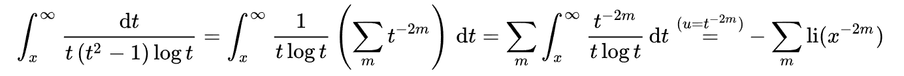
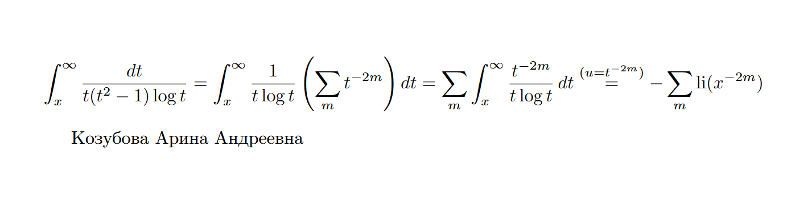
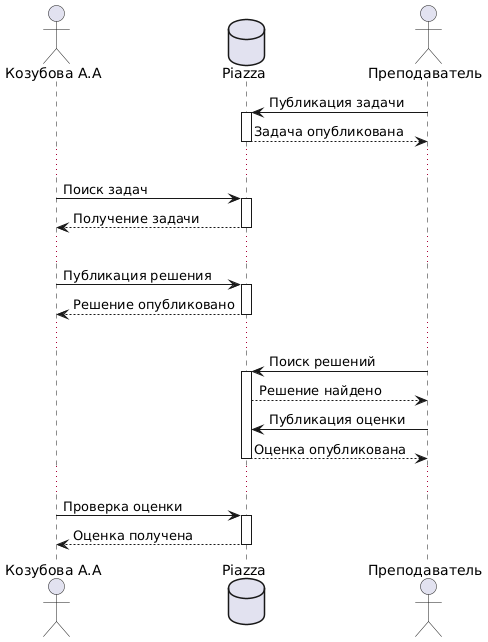

# Задача 1
Реализовать с помощью математического языка LaTeX нижеприведенную формулу:

Прислать код на LaTeX и картинку-результат, где, помимо формулы, будет указано ФИО студента.
```latex
\documentclass{article}
\usepackage{amsmath}
\usepackage[utf8]{inputenc}
\usepackage[russian]{babel}

\begin{document}

\begin{equation*}
\int_{x}^{\infty} \frac{dt}{t(t^2 - 1) \log t} = \int_{x}^{\infty} \frac{1}{t \log t} \left( \sum_{m} t^{-2m} \right) dt = \sum_{m} \int_{x}^{\infty} \frac{t^{-2m}}{t \log t} \, dt \overset{(u = t^{-2m})}{=} - \sum_{m} \operatorname{li}(x^{-2m})
\end{equation*}

\text{Козубова Арина Андреевна}

\end{document}
```


# Задание 2


```uml
@startuml
actor "Козубова А.А" as student
database Piazza as piazza
actor Преподаватель as teacher


teacher -> piazza : Публикация задачи
activate piazza
piazza --> teacher : Задача опубликована
deactivate piazza
...

student -> piazza : Поиск задач
activate piazza
piazza --> student : Получение задачи
deactivate piazza
...

student -> piazza : Публикация решения
activate piazza
piazza --> student : Решение опубликовано
deactivate piazza
...

teacher -> piazza : Поиск решений
activate piazza
piazza --> teacher : Решение найдено

teacher -> piazza : Публикация оценки
piazza --> teacher : Оценка опубликована
deactivate piazza
...

student -> piazza : Проверка оценки
activate piazza
piazza --> student : Оценка получена
deactivate piazza

@enduml
```

# Задание 3
```noweb
\documentclass{article}
\usepackage{hyperref}
\title{Sorting Algorithm in Noweb\\ \footnote{Разработала Козубова А.А.}}
\author{Козубова А.А.}
\begin{document}
\maketitle

\section{Introduction}

This document demonstrates the implementation of a sorting algorithm using noweb. The algorithm we will be implementing is \emph{quick sort}, a commonly used divide-and-conquer sorting technique.

\section{Quick Sort Algorithm}

The quick sort algorithm follows a simple approach:

\begin{enumerate}
    \item Select a pivot element from the array.
    \item Partition the other elements into two sub-arrays according to whether they are less than or greater than the pivot.
    \item Recursively apply the same process to the sub-arrays.
\end{enumerate}

The process continues until the base case is reached, where the sub-arrays have less than or equal to one element, at which point the array is sorted.

\subsection{Partitioning}

The key to quicksort's efficiency is the partitioning step, where the array is rearranged such that all elements smaller than the pivot are placed to the left, and all elements greater than the pivot are placed to the right.

\begin{verbatim}
<<partition function>>=
def partition(arr, low, high):
    pivot = arr[high]
    i = low - 1
    for j in range(low, high):
        if arr[j] <= pivot:
            i += 1
            arr[i], arr[j] = arr[j], arr[i]
    arr[i + 1], arr[high] = arr[high], arr[i + 1]
    return i + 1
\end{verbatim}

\subsection{Quick Sort Function}

The quicksort function repeatedly partitions the array and recursively sorts the sub-arrays.

\begin{verbatim}
<<quick sort function>>=
def quicksort(arr, low, high):
    if low < high:
        pi = partition(arr, low, high)
        quicksort(arr, low, pi - 1)
        quicksort(arr, pi + 1, high)
\end{verbatim}

\subsection{Main Function}

Finally, the main function calls the quicksort function and prints the sorted array.

\begin{verbatim}
<<main function>>=
if __name__ == "__main__":
    arr = [10, 7, 8, 9, 1, 5]
    n = len(arr)
    quicksort(arr, 0, n - 1)
    print("Sorted array is:", arr)
\end{verbatim}

\section{Complete Code Listing}

The complete code for the quicksort algorithm is shown below.

\begin{verbatim}
<<*>>=
<<partition function>>
<<quick sort function>>
<<main function>>
\end{verbatim}

\end{document}
```

```py
def partition(arr, low, high):
    pivot = arr[high]
    i = low - 1
    for j in range(low, high):
        if arr[j] <= pivot:
            i += 1
            arr[i], arr[j] = arr[j], arr[i]
    arr[i + 1], arr[high] = arr[high], arr[i + 1]
    return i + 1

def quicksort(arr, low, high):
    if low < high:
        pi = partition(arr, low, high)
        quicksort(arr, low, pi - 1)
        quicksort(arr, pi + 1, high)

if __name__ == "__main__":
    arr = [10, 7, 8, 9, 1, 5]
    n = len(arr)
    quicksort(arr, 0, n - 1)
    print("Sorted array is:", arr)
```
